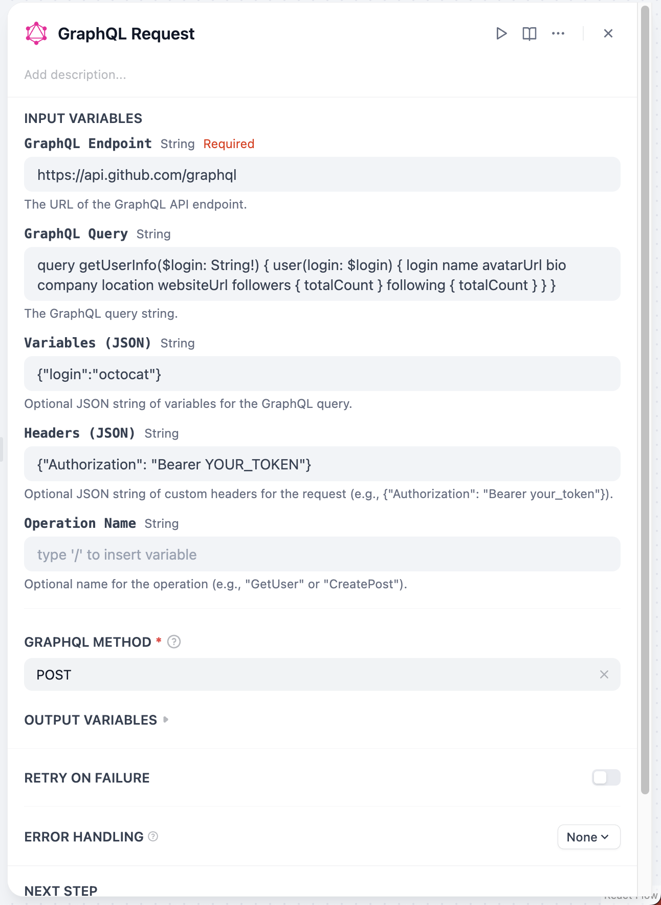
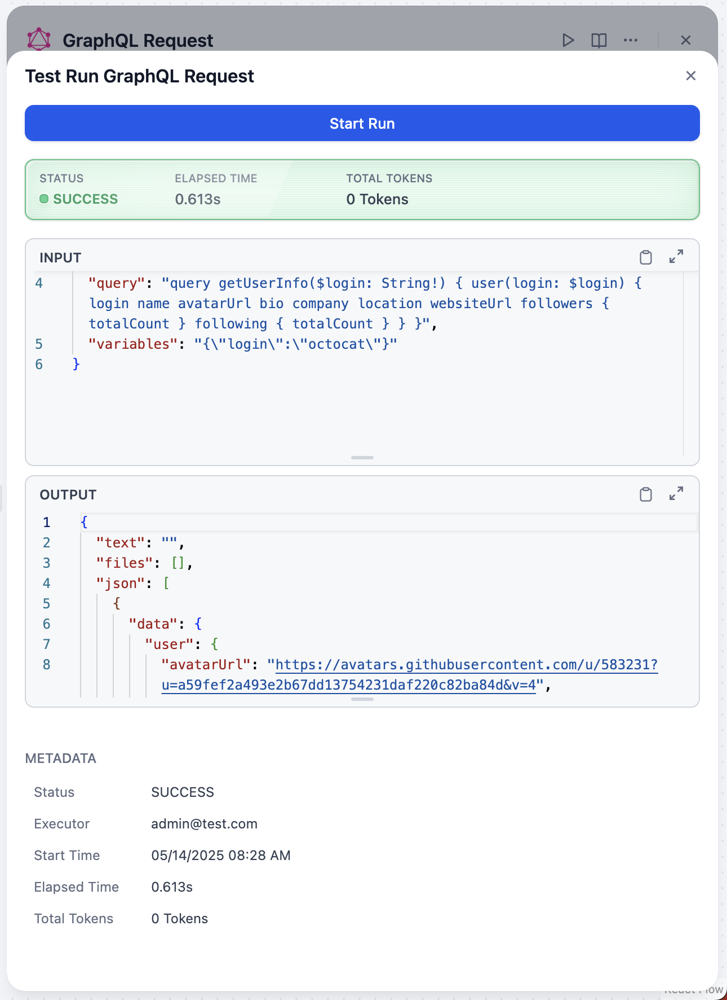

# GraphQL Plugin for Dify

**Author:** jingfelix
**Version:** 0.0.1
**Type:** Plugin

## Description

This plugin allows Dify to interact with GraphQL APIs. It enables you to send GraphQL queries and mutations to a specified GraphQL endpoint and retrieve the results. This can be used to fetch data, update data, or trigger actions on services that expose a GraphQL interface.

## Usage

1. Setup
  - Install the plugin in your Dify environment.
  - Fill in the required fields, including the GraphQL endpoint URL and any necessary authentication headers, or the queries and mutations you want to execute.

2. Sending Queries/Mutations
  - Use the plugin to send GraphQL queries or mutations to the specified endpoint.
  - The plugin will handle the request and return the response from the GraphQL API.

  
  

## Troubleshooting

- If you encounter issues, check the following:
  - Ensure the GraphQL endpoint URL is correct and accessible on Dify instance.
  - Check the syntax of your GraphQL queries or mutations.
  - Try increasing the retry count in the plugin settings if you are experiencing timeouts or network errors.

## License
Distributed under the MIT License. See `LICENSE` file for more information.

Last updated: 2025-05-14
